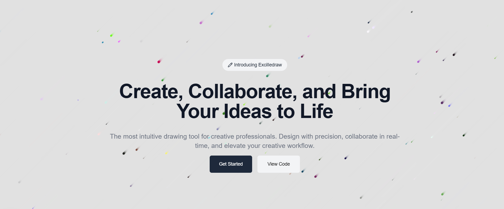

# DrawApp 🎨✨

Welcome to **DrawApp**, a web-based drawing application that brings the best of both worlds—Excel's grid structure and the creativity of digital drawing. With **DrawApp**, you can draw and design using a simple grid interface that mimics the look and feel of Excel, making it easy to sketch, plan, and create artwork or designs in a familiar environment.

Whether you're looking to doodle, create pixel art, or organize your thoughts visually, **DrawApp** provides the tools to express yourself.

---

## Features 🚀

- **Grid-Based Drawing**: Just like Excel, but with the freedom to draw pixel by pixel! 🖼️
- **Easy-to-Use Interface**: Intuitive design with simple controls for drawing and filling cells. 🖌️
- **Customizable Colors**: Choose from a wide variety of colors to bring your creations to life. 🎨
- **Cell-Based Drawing**: Create art in the form of cell-based pixels or use the grid to make structured diagrams. 📊
- **Zoom In/Out**: Adjust the zoom level to view larger or smaller portions of your drawing. 🔍
- **Export Your Art**: Download your creations in PNG format for easy sharing or printing. 📥

---

## Getting Started 💻

To get started with **DrawApp**, you can run it locally or access the live version online.

### Prerequisites 🛠️

Before running the app locally, ensure you have the following installed:

- [Node.js](https://nodejs.org/) (for backend and package management)
- [Git](https://git-scm.com/) (to clone the repo)
- [Pnpm](https://pnpm.io/installation) (package manager)

### Clone the Repository 📂

```bash
git clone https://github.com/shwetank-nitp/ten-hands.git
cd excelledraw-clone
```

### Install Dependencies 📦

Run the following command to install the required dependencies:

```bash
pnpm install
```

### Run the App Locally 🏃‍♂️

Once all dependencies are installed, start the local server:

```bash
pnpm run dev
```

or

```bash
npm run dev
```

Visit `http://localhost:3000` in your browser to start drawing!
or `http://localhost:3001` check console logs

---

## Screenshots 📸


_Screenshort of landing page._

---

## Contributing 🤝

We welcome contributions from the community! If you'd like to contribute to **DrawApp**, follow these steps:

1. Fork the repository.
2. Create a new branch (`git checkout -b feature-name`).
3. Make your changes and commit them (`git commit -am 'Add new feature'`).
4. Push to the branch (`git push origin feature-name`).
5. Create a pull request and describe your changes.

---

## License 📜

This project is licensed under the MIT License - see the [LICENSE](LICENSE) file for details.

---

## Contact ✉️

For any questions, suggestions, or feedback, feel free to reach out:

- Email: [your-email@example.com](mailto:shwetankrai93@gmail.com)
- GitHub: [@yourusername](https://github.com/shwetank-nitp)

---

Thanks for checking out **DrawApp**! Happy drawing! 🎨

---

This README template can be further customized as needed. Let me know if you'd like to change anything or add more details!
